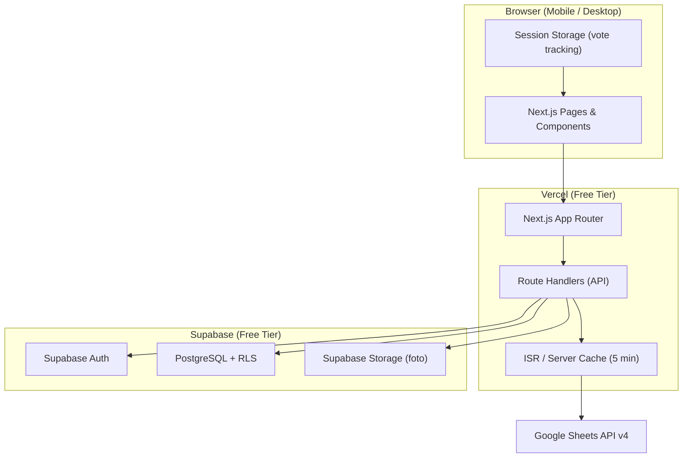
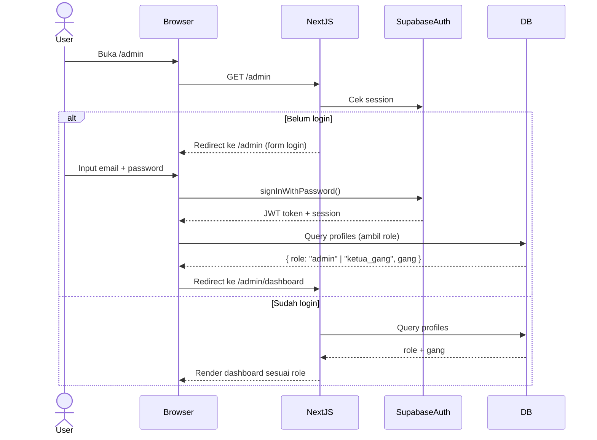
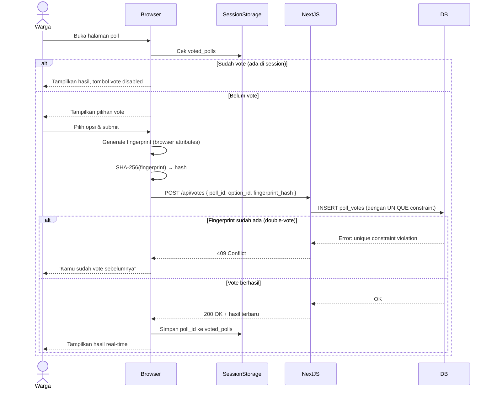

# Design — Portal Warga Bukit Pandawa
> Godean Jogja Hills · Versi 1.0

---

## Overview

Portal Warga Bukit Pandawa adalah aplikasi web komunitas untuk warga perumahan Bukit Pandawa (Godean Jogja Hills). Aplikasi ini menyediakan satu titik akses terpusat untuk:

- **Informasi keuangan** — laporan arus kas yang dibaca langsung dari Google Sheets
- **Galeri foto** — dokumentasi acara perumahan dengan album dan lightbox
- **Pengumuman** — informasi terbaru dari pengurus perumahan
- **Voting** — pengambilan keputusan bersama via poll publik maupun per gang

Prinsip desain utama: **seringan mungkin, mobile-first, biaya Rp 0**. Tidak ada library UI berat, tidak ada server mandiri — semua berjalan di atas free tier Vercel + Supabase.

### Keputusan Arsitektur Utama

| Keputusan | Pilihan | Alasan |
|---|---|---|
| Framework | Next.js App Router | SSR/ISR bawaan, deploy ke Vercel tanpa konfigurasi |
| Database | Supabase (PostgreSQL) | Auth bawaan, RLS, Storage, dashboard visual, free tier |
| Data keuangan | Google Sheets API (read-only) | Admin tetap pakai Sheets, web hanya baca |
| Styling | Tailwind CSS | Utility-first, tidak ada runtime overhead |
| Auth | Supabase Auth | Tidak perlu library tambahan, mendukung RLS |
| Anti double-vote | Fingerprint + session storage | Best-effort untuk skala komunitas kecil |

---

## Architecture

### Diagram Arsitektur Tingkat Tinggi



### Pola Rendering

| Halaman | Strategi | Alasan |
|---|---|---|
| `/` Beranda | ISR (revalidate 60s) | Konten berubah jarang, perlu cepat |
| `/keuangan` | ISR (revalidate 300s) | Cache Google Sheets 5 menit |
| `/galeri` | ISR (revalidate 60s) | Foto jarang berubah |
| `/voting` | SSR | Data poll harus real-time |
| `/voting/[token]` | SSR | Data poll harus real-time |
| `/admin/*` | CSR (client-side) | Halaman terproteksi, tidak perlu SEO |

### Alur Autentikasi



### Alur Voting (Anti Double-Vote)



---

## Components and Interfaces

### Struktur Direktori Proyek

```
src/
├── app/
│   ├── (public)/
│   │   ├── page.tsx                  # Beranda
│   │   ├── keuangan/page.tsx         # Laporan keuangan
│   │   ├── galeri/page.tsx           # Galeri foto
│   │   ├── voting/
│   │   │   ├── page.tsx              # Daftar poll publik
│   │   │   └── [token]/page.tsx      # Poll per gang
│   ├── admin/
│   │   ├── page.tsx                  # Login
│   │   ├── dashboard/page.tsx
│   │   ├── pengumuman/page.tsx
│   │   ├── galeri/page.tsx
│   │   ├── voting/page.tsx
│   │   └── akun/page.tsx
│   └── api/
│       ├── votes/route.ts            # POST vote
│       ├── keuangan/route.ts         # GET data Google Sheets
│       └── admin/
│           ├── polls/route.ts
│           ├── announcements/route.ts
│           └── accounts/route.ts
├── components/
│   ├── layout/
│   │   ├── BottomNav.tsx             # Mobile bottom navigation
│   │   ├── Header.tsx
│   │   └── AdminSidebar.tsx
│   ├── voting/
│   │   ├── PollCard.tsx
│   │   ├── VoteForm.tsx
│   │   └── VoteResults.tsx
│   ├── gallery/
│   │   ├── AlbumGrid.tsx
│   │   ├── PhotoGrid.tsx
│   │   └── Lightbox.tsx
│   ├── finance/
│   │   ├── FinanceTable.tsx
│   │   └── SheetSelector.tsx
│   └── ui/
│       ├── Button.tsx
│       ├── Badge.tsx
│       └── EmptyState.tsx
├── lib/
│   ├── supabase/
│   │   ├── client.ts                 # Browser client
│   │   ├── server.ts                 # Server client (cookies)
│   │   └── admin.ts                  # Service role client
│   ├── google-sheets.ts              # Google Sheets API wrapper
│   ├── fingerprint.ts                # Browser fingerprint + hash
│   └── utils.ts
└── types/
    └── index.ts                      # Shared TypeScript types
```

### API Interfaces

#### `POST /api/votes`
```typescript
// Request
interface VoteRequest {
  poll_id: string;       // UUID
  option_id: string;     // UUID
  fingerprint_hash: string; // SHA-256 hex string
}

// Response 200
interface VoteResponse {
  success: true;
  results: PollResult[];
}

// Response 409 (double-vote)
interface VoteConflictResponse {
  success: false;
  error: "already_voted";
}

// Response 400 (poll closed)
interface VoteClosedResponse {
  success: false;
  error: "poll_closed";
}
```

#### `GET /api/keuangan`
```typescript
// Query params: ?sheet=<sheet_name>
interface FinanceResponse {
  data: FinanceRow[];
  last_updated: string;  // ISO timestamp dari sheet
  from_cache: boolean;
  available_sheets: string[];
}

interface FinanceRow {
  tanggal: string;
  keterangan: string;
  pemasukan: number | null;
  pengeluaran: number | null;
  saldo: number;
}

// Response 503 (API error, no cache)
interface FinanceErrorResponse {
  error: "sheets_unavailable";
  message: string;
}
```

### Komponen Utama

#### `VoteForm`
Menerima props `poll` dan `onVoted`. Mengelola state lokal: apakah sudah vote (cek session storage), pilihan yang dipilih, loading state. Memanggil `POST /api/votes` dan menampilkan hasil setelah vote.

#### `PollCard`
Menampilkan ringkasan poll: judul, status (aktif/selesai), jumlah suara, waktu tersisa. Digunakan di halaman `/voting` dan banner beranda.

#### `FinanceTable`
Menerima array `FinanceRow`, render tabel dengan scroll horizontal di mobile. Menampilkan total pemasukan, pengeluaran, dan saldo akhir di footer tabel.

#### `Lightbox`
Komponen modal untuk menampilkan foto ukuran penuh. Mendukung navigasi prev/next, close via Escape atau klik luar.

#### `BottomNav`
Navigasi bawah untuk mobile (beranda, keuangan, galeri, voting). Sticky di bottom, hidden di desktop (diganti header nav).

---

## Data Models

### TypeScript Types

```typescript
// ─── Auth & Users ───────────────────────────────────────────────

export type UserRole = "admin" | "ketua_gang";

export interface Profile {
  id: string;           // UUID, FK ke auth.users
  name: string;
  role: UserRole;
  gang: string | null;  // Diisi jika role = ketua_gang
  created_at: string;
}

// ─── Announcements ──────────────────────────────────────────────

export type AnnouncementPriority = "normal" | "urgent";

export interface Announcement {
  id: string;
  title: string;
  body: string;
  priority: AnnouncementPriority;
  created_by: string;   // UUID FK ke profiles
  created_at: string;
  updated_at: string | null;
}

// ─── Gallery ────────────────────────────────────────────────────

export interface GalleryAlbum {
  id: string;
  name: string;
  description: string | null;
  cover_url: string | null;
  created_at: string;
}

export interface GalleryPhoto {
  id: string;
  album_id: string;
  url: string;          // Path di Supabase Storage
  caption: string | null;
  uploaded_by: string;  // UUID FK ke profiles
  created_at: string;
}

// ─── Voting ─────────────────────────────────────────────────────

export type PollType = "public" | "gang";
export type PollStatus = "active" | "closed";

export interface Poll {
  id: string;
  title: string;
  description: string | null;
  type: PollType;
  gang_scope: string | null;    // Diisi jika type = gang
  secret_token: string | null;  // Diisi jika type = gang
  status: PollStatus;
  closes_at: string | null;     // null = tutup manual
  created_by: string;
  created_at: string;
}

export interface PollOption {
  id: string;
  poll_id: string;
  label: string;
  order: number;
}

export interface PollVote {
  id: string;
  poll_id: string;
  option_id: string;
  fingerprint_hash: string;     // SHA-256 hex
  voted_at: string;
}

// ─── Derived / View Types ────────────────────────────────────────

export interface PollResult {
  option_id: string;
  label: string;
  vote_count: number;
  percentage: number;           // 0–100, dibulatkan 1 desimal
}

export interface PollWithResults extends Poll {
  options: PollOption[];
  results: PollResult[];
  total_votes: number;
}

// ─── Finance ─────────────────────────────────────────────────────

export interface FinanceRow {
  tanggal: string;
  keterangan: string;
  pemasukan: number | null;
  pengeluaran: number | null;
  saldo: number;
}

export interface FinanceData {
  rows: FinanceRow[];
  last_updated: string;
  from_cache: boolean;
  available_sheets: string[];
}
```

### Skema Database (Supabase SQL)

```sql
-- Profiles (extend Supabase Auth)
CREATE TABLE profiles (
  id          UUID PRIMARY KEY REFERENCES auth.users(id) ON DELETE CASCADE,
  name        TEXT NOT NULL,
  role        TEXT NOT NULL CHECK (role IN ('admin', 'ketua_gang')),
  gang        TEXT,
  created_at  TIMESTAMPTZ NOT NULL DEFAULT NOW()
);

-- Announcements
CREATE TABLE announcements (
  id          UUID PRIMARY KEY DEFAULT gen_random_uuid(),
  title       TEXT NOT NULL,
  body        TEXT NOT NULL,
  priority    TEXT NOT NULL DEFAULT 'normal' CHECK (priority IN ('normal', 'urgent')),
  created_by  UUID NOT NULL REFERENCES profiles(id),
  created_at  TIMESTAMPTZ NOT NULL DEFAULT NOW(),
  updated_at  TIMESTAMPTZ
);

-- Gallery Albums
CREATE TABLE gallery_albums (
  id          UUID PRIMARY KEY DEFAULT gen_random_uuid(),
  name        TEXT NOT NULL,
  description TEXT,
  cover_url   TEXT,
  created_at  TIMESTAMPTZ NOT NULL DEFAULT NOW()
);

-- Gallery Photos
CREATE TABLE gallery_photos (
  id          UUID PRIMARY KEY DEFAULT gen_random_uuid(),
  album_id    UUID NOT NULL REFERENCES gallery_albums(id) ON DELETE CASCADE,
  url         TEXT NOT NULL,
  caption     TEXT,
  uploaded_by UUID NOT NULL REFERENCES profiles(id),
  created_at  TIMESTAMPTZ NOT NULL DEFAULT NOW()
);

-- Polls
CREATE TABLE polls (
  id           UUID PRIMARY KEY DEFAULT gen_random_uuid(),
  title        TEXT NOT NULL,
  description  TEXT,
  type         TEXT NOT NULL CHECK (type IN ('public', 'gang')),
  gang_scope   TEXT,
  secret_token TEXT UNIQUE,
  status       TEXT NOT NULL DEFAULT 'active' CHECK (status IN ('active', 'closed')),
  closes_at    TIMESTAMPTZ,
  created_by   UUID NOT NULL REFERENCES profiles(id),
  created_at   TIMESTAMPTZ NOT NULL DEFAULT NOW()
);

-- Poll Options
CREATE TABLE poll_options (
  id       UUID PRIMARY KEY DEFAULT gen_random_uuid(),
  poll_id  UUID NOT NULL REFERENCES polls(id) ON DELETE CASCADE,
  label    TEXT NOT NULL,
  "order"  INTEGER NOT NULL DEFAULT 0
);

-- Poll Votes
CREATE TABLE poll_votes (
  id               UUID PRIMARY KEY DEFAULT gen_random_uuid(),
  poll_id          UUID NOT NULL REFERENCES polls(id) ON DELETE CASCADE,
  option_id        UUID NOT NULL REFERENCES poll_options(id) ON DELETE CASCADE,
  fingerprint_hash TEXT NOT NULL,
  voted_at         TIMESTAMPTZ NOT NULL DEFAULT NOW(),
  UNIQUE (poll_id, fingerprint_hash)  -- Cegah double-vote di level DB
);

-- Row Level Security
ALTER TABLE profiles        ENABLE ROW LEVEL SECURITY;
ALTER TABLE announcements   ENABLE ROW LEVEL SECURITY;
ALTER TABLE gallery_albums  ENABLE ROW LEVEL SECURITY;
ALTER TABLE gallery_photos  ENABLE ROW LEVEL SECURITY;
ALTER TABLE polls           ENABLE ROW LEVEL SECURITY;
ALTER TABLE poll_options    ENABLE ROW LEVEL SECURITY;
ALTER TABLE poll_votes      ENABLE ROW LEVEL SECURITY;

-- RLS Policies (contoh utama)

-- Profiles: hanya bisa baca profil sendiri; admin bisa baca semua
CREATE POLICY "profiles_select_own" ON profiles
  FOR SELECT USING (auth.uid() = id);

CREATE POLICY "profiles_select_admin" ON profiles
  FOR SELECT USING (
    EXISTS (SELECT 1 FROM profiles WHERE id = auth.uid() AND role = 'admin')
  );

-- Announcements: publik bisa baca; hanya admin bisa tulis
CREATE POLICY "announcements_select_public" ON announcements
  FOR SELECT USING (true);

CREATE POLICY "announcements_insert_admin" ON announcements
  FOR INSERT WITH CHECK (
    EXISTS (SELECT 1 FROM profiles WHERE id = auth.uid() AND role = 'admin')
  );

-- Polls: publik bisa baca poll aktif; insert oleh admin/ketua_gang
CREATE POLICY "polls_select_public" ON polls
  FOR SELECT USING (status = 'active' OR status = 'closed');

CREATE POLICY "polls_insert_auth" ON polls
  FOR INSERT WITH CHECK (auth.uid() IS NOT NULL);

-- Poll Votes: siapa pun bisa insert (tanpa login); tidak bisa baca vote orang lain
CREATE POLICY "poll_votes_insert_anon" ON poll_votes
  FOR INSERT WITH CHECK (true);

CREATE POLICY "poll_votes_select_own" ON poll_votes
  FOR SELECT USING (false);  -- Tidak ada yang bisa baca raw votes
```

### Indeks Database

```sql
-- Performa query umum
CREATE INDEX idx_announcements_created_at ON announcements(created_at DESC);
CREATE INDEX idx_gallery_photos_album_id  ON gallery_photos(album_id);
CREATE INDEX idx_polls_type_status        ON polls(type, status);
CREATE INDEX idx_poll_options_poll_id     ON poll_options(poll_id);
CREATE INDEX idx_poll_votes_poll_id       ON poll_votes(poll_id);
CREATE INDEX idx_polls_secret_token       ON polls(secret_token) WHERE secret_token IS NOT NULL;
```

---

## Correctness Properties

*A property is a characteristic or behavior that should hold true across all valid executions of a system — essentially, a formal statement about what the system should do. Properties serve as the bridge between human-readable specifications and machine-verifiable correctness guarantees.*

### Property 1: Beranda membatasi pengumuman yang ditampilkan

*For any* daftar pengumuman di database (berapapun jumlahnya), fungsi yang mengambil pengumuman untuk beranda harus selalu mengembalikan maksimal 5 item, diurutkan dari yang terbaru.

**Validates: Requirements 4.1**

---

### Property 2: Poll closed selalu menolak vote baru

*For any* poll dengan status `closed` (baik ditutup manual maupun via timer `closes_at`), setiap permintaan vote baru — terlepas dari `option_id` atau `fingerprint_hash` yang dikirim — harus selalu ditolak dengan error `poll_closed`.

**Validates: Requirements 4.4, 5 (catatan keamanan)**

---

### Property 3: Anti double-vote via fingerprint

*For any* poll aktif dan sembarang `fingerprint_hash`, jika vote pertama berhasil disimpan, maka vote kedua dengan `poll_id` dan `fingerprint_hash` yang sama harus selalu ditolak dengan error `already_voted`, terlepas dari `option_id` yang dipilih.

**Validates: Requirements 4.4, 4.5, 5**

---

### Property 4: Kalkulasi persentase hasil voting akurat dan konsisten

*For any* distribusi suara pada poll dengan satu atau lebih opsi, hasil kalkulasi harus memenuhi: (1) setiap `percentage` = `vote_count / total_votes * 100`, (2) `sum(percentage)` = 100 (dengan toleransi pembulatan ±0.1%), dan (3) `sum(vote_count)` = `total_votes`.

**Validates: Requirements 4.4**

---

### Property 5: Poll gang tidak muncul di listing publik

*For any* kombinasi poll publik dan poll gang di database, query yang digunakan untuk halaman `/voting` harus hanya mengembalikan poll dengan `type = 'public'` — tidak pernah mengembalikan poll dengan `type = 'gang'`, terlepas dari status atau `gang_scope`-nya.

**Validates: Requirements 4.4, 4.5**

---

### Property 6: Secret token valid dan unik

*For any* kumpulan N secret token yang di-generate (N ≥ 1), setiap token harus: (1) tepat 12 karakter, (2) hanya mengandung karakter alfanumerik atau URL-safe, dan (3) tidak ada dua token yang identik dalam kumpulan tersebut.

**Validates: Requirements 4.5, 5, 9**

---

### Property 7: Fingerprint hash deterministik dan berformat valid

*For any* string fingerprint, fungsi hash harus menghasilkan output yang: (1) selalu tepat 64 karakter hexadecimal lowercase, (2) deterministik — input yang sama selalu menghasilkan output yang sama, dan (3) berbeda untuk input yang berbeda (dalam sample pengujian yang wajar).

**Validates: Requirements 5, 6**

---

### Property 8: Fallback cache saat Google Sheets tidak tersedia

*For any* jenis error dari Google Sheets API (network error, 403, 429, format tidak valid), jika data cache tersedia, fungsi `getFinanceData` harus selalu mengembalikan data cache dengan flag `from_cache = true`. Jika tidak ada cache, harus mengembalikan error yang informatif — tidak pernah crash atau mengembalikan data kosong tanpa keterangan.

**Validates: Requirements 4.2, 7**

---

### Property 9: Parsing data Google Sheets menghasilkan FinanceRow yang benar

*For any* array `FinanceRow` yang valid, jika di-serialisasi ke format Google Sheets (baris header + baris data) lalu di-parse kembali, hasilnya harus identik dengan input awal — nilai numerik tetap numerik, nilai null tetap null, dan urutan baris terjaga.

**Validates: Requirements 4.2, 7**

---

## Error Handling

### Strategi Umum

Semua error ditangani di lapisan yang paling dekat dengan sumbernya. Pengguna selalu mendapat pesan yang informatif, bukan stack trace atau pesan teknis.

### Error per Modul

#### Google Sheets API
| Kondisi | Penanganan |
|---|---|
| API key tidak valid / quota habis | Tampilkan cache + label "Data mungkin tidak terbaru" |
| Format sheet berubah (kolom hilang) | Log error server, tampilkan pesan "Format data tidak dikenali" |
| Network timeout | Retry 1x, lalu fallback ke cache |
| Tidak ada cache sama sekali | Tampilkan halaman error dengan pesan deskriptif |

#### Voting
| Kondisi | Penanganan |
|---|---|
| Vote ke poll closed | HTTP 400, `{ error: "poll_closed" }` |
| Double-vote (DB constraint) | HTTP 409, `{ error: "already_voted" }` |
| Poll tidak ditemukan | HTTP 404, `{ error: "poll_not_found" }` |
| Token gang tidak valid | HTTP 404 (tidak membedakan "tidak ada" vs "salah token") |
| Fingerprint hash tidak valid | HTTP 400, `{ error: "invalid_fingerprint" }` |

#### Autentikasi
| Kondisi | Penanganan |
|---|---|
| Login gagal | Pesan generik "Email atau password salah" (tidak membedakan keduanya) |
| Session expired | Redirect ke `/admin` dengan query `?expired=1` |
| Akses halaman admin tanpa login | Redirect ke `/admin` |
| Ketua gang akses halaman admin-only | HTTP 403, redirect ke dashboard |

#### Upload Foto
| Kondisi | Penanganan |
|---|---|
| File terlalu besar (> 5MB) | Validasi client-side sebelum upload, pesan error jelas |
| Format tidak didukung | Hanya terima `image/jpeg`, `image/png`, `image/webp` |
| Supabase Storage error | Tampilkan pesan error, jangan simpan record ke DB jika upload gagal |

### Error Boundaries

- Setiap halaman publik memiliki `error.tsx` Next.js untuk menangkap error rendering
- Komponen voting memiliki error boundary tersendiri agar error vote tidak merusak halaman
- API routes selalu mengembalikan JSON dengan struktur `{ error: string, message?: string }`

---

## Testing Strategy

### Pendekatan Dual Testing

Pengujian menggunakan dua lapisan yang saling melengkapi:

1. **Unit tests + Property-based tests** — untuk logika bisnis murni (pure functions)
2. **Integration tests** — untuk interaksi dengan Supabase dan Google Sheets API

### Library yang Digunakan

| Jenis | Library | Alasan |
|---|---|---|
| Test runner | **Vitest** | Cepat, kompatibel dengan Next.js, ESM native |
| Property-based testing | **fast-check** | Mature, TypeScript-first, banyak arbitrary bawaan |
| Mocking | Vitest built-in (`vi.mock`) | Tidak perlu library tambahan |
| Integration test | Vitest + Supabase test client | Test terhadap Supabase lokal / staging |

### Property-Based Tests (fast-check)

Setiap property di atas diimplementasikan sebagai satu property test dengan minimum **100 iterasi**.

Setiap test diberi tag komentar dengan format:
```
// Feature: portal-warga-bukit-pandawa, Property N: <deskripsi singkat>
```

**Contoh implementasi Property 4 (kalkulasi persentase):**
```typescript
// Feature: portal-warga-bukit-pandawa, Property 4: vote percentage calculation accuracy
import { fc } from "fast-check";
import { calculatePollResults } from "@/lib/voting";

test("kalkulasi persentase akurat untuk semua distribusi suara", () => {
  fc.assert(
    fc.property(
      fc.array(fc.nat({ max: 1000 }), { minLength: 1, maxLength: 10 }),
      (voteCounts) => {
        const total = voteCounts.reduce((a, b) => a + b, 0);
        if (total === 0) return true; // skip edge case total = 0

        const results = calculatePollResults(voteCounts);
        const sumPercentage = results.reduce((a, r) => a + r.percentage, 0);
        const sumVotes = results.reduce((a, r) => a + r.vote_count, 0);

        return (
          Math.abs(sumPercentage - 100) < 0.1 && // toleransi pembulatan
          sumVotes === total
        );
      }
    ),
    { numRuns: 100 }
  );
});
```

**Contoh implementasi Property 6 (secret token):**
```typescript
// Feature: portal-warga-bukit-pandawa, Property 6: secret token validity and uniqueness
import { generateSecretToken } from "@/lib/utils";

test("secret token selalu 12 karakter dan unik dalam batch", () => {
  fc.assert(
    fc.property(
      fc.integer({ min: 1, max: 100 }),
      (n) => {
        const tokens = Array.from({ length: n }, () => generateSecretToken());
        const allLength12 = tokens.every((t) => t.length === 12);
        const allUnique = new Set(tokens).size === tokens.length;
        return allLength12 && allUnique;
      }
    ),
    { numRuns: 100 }
  );
});
```

### Unit Tests

Unit tests fokus pada:
- Skenario konkret yang tidak tercakup property tests (contoh: poll dengan 0 suara)
- Error conditions dengan input spesifik
- Integrasi antar komponen (contoh: VoteForm + VoteResults)

Hindari menulis terlalu banyak unit test untuk logika yang sudah dicakup property tests.

### Integration Tests

| Area | Apa yang ditest | Jumlah contoh |
|---|---|---|
| Google Sheets API | Cache hit/miss, fallback error | 2–3 |
| Supabase UNIQUE constraint | Double-vote bypass via API langsung | 1 |
| RLS policies | Akses tanpa auth ke tabel terproteksi | 3–5 |
| Auth flow | Login admin, login ketua gang, session expired | 3 |

### Smoke Tests

| Check | Cara verifikasi |
|---|---|
| RLS aktif di semua tabel | Query `pg_tables` + `relrowsecurity` |
| Environment variable tidak di-expose | Cek bundle output Next.js |
| Secret token menggunakan CSPRNG | Code review + audit `crypto.getRandomValues` |

### Cakupan yang Tidak Ditest Otomatis

- Tampilan visual dan responsivitas (manual testing di berbagai device)
- Lightbox foto (manual testing)
- Performa Lighthouse score (manual audit)
- Aksesibilitas (manual testing dengan screen reader)

---

*Design document ini mengacu pada requirements.md versi 1.0. Perubahan requirement yang signifikan perlu diikuti dengan revisi design ini.*
